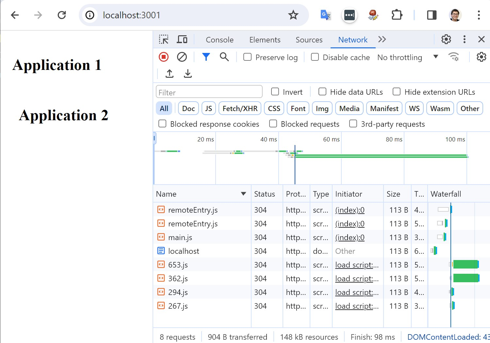

# my-federation-example

Webpack Module Federation Plugin Example (https://webpack.js.org/concepts/module-federation/)

It contains two applications, application-a uses a React component from application-b.

## How to run

Do yarn install in `/application-a` and `/application-b` folders and run `yarn dev` in the root folder. I will run two application on ports 3001 and 3002.